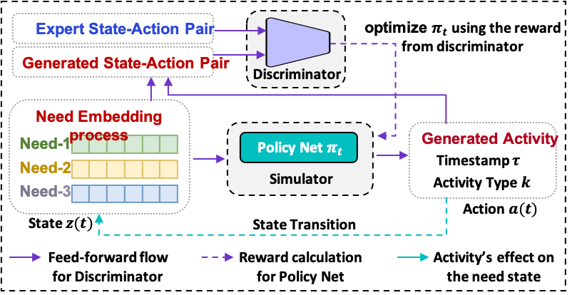

# SAND



The official PyTorch implementation of "Learning to Simulate Daily Activities via Modeling Dynamic Human Needs" (WWW'23).

The code is tested under a Linux desktop with torch 1.7 and Python 3.7.10.

## Installation

### Environment
- Tested OS: Linux
- Python >= 3.7
- PyTorch == 1.7.1

### Dependencies
1. Install PyTorch 1.7.1 with the correct CUDA version.
2. Use the ``pip install -r requirements. txt`` command to install all of the Python modules and packages used in this project.

## Model Training

Use the following command to train SAND on the `Foursquare` dataset: 

``
cd SAND;
``

``
python app.py --dataset 'Foursquare' --mode 'train'
``

or on the Mobile Operator dataset:

``
python app.py --dataset 'Mobile' --mode 'train'
``

or on the Synthetic Operator dataset:

``
python app.py --dataset 'Synthetic' --mode 'train'
``

The trained models are saved in ``model/TIME/``.


## Simulation

Use the following command to generate activity data on the `Foursquare` dataset: 

``
cd SAND;
``

``
python app.py --dataset 'Foursquare' --mode 'generate' --generate_final_path your_path
``

Please specify your own path by the command-line argument ``generate_final_path``  for saving the generated data. Then the generated activity data will be in ``your_path/gen_data.json``.

## More Related Works

*[Learning to Simulate Daily Activities via Modeling Dynamic Human Needs](https://github.com/tsinghua-fib-lab/Activity-Trajectory-Generation)* 

## Note

The implemention is based on *[NJSDE](https://github.com/000Justin000/torchdiffeq/tree/jj585)*.

If you found this library useful in your research, please consider citing:

```
@inproceedings{yuan2023learning,
  title={Learning to Simulate Daily Activities via Modeling Dynamic Human Needs},
  author={Yuan, Yuan and Wang, Huandong and Ding, Jingtao and Jin, Depeng and Li, Yong},
  booktitle={Proceedings of the ACM Web Conference 2023},
  pages={906--916},
  year={2023}
}
```
